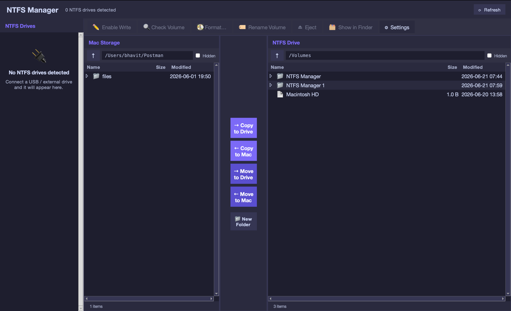

# NTFS Manager

**Read *and* write your Windows (NTFS) drives on macOS — for free.**

macOS can only *read* NTFS-formatted drives out of the box. NTFS Manager adds
full **read/write** access, so you can copy, move, rename, and delete files on
external NTFS drives — including on **macOS 26 (Tahoe)**, where the older drivers
no longer work.

No subscription. No kernel extension. No reboot.



---

## Features

- ✍️ **Full read/write** access to NTFS drives
- 🗂 **Built-in dual-pane file browser** — copy & move between your Mac and the drive
- ⚡ **Fast transfers** with progress, speed, ETA, and cancel
- 🧰 One-click **Enable / Disable Write**, **Eject**, **Check Volume**, and **Format** (NTFS or exFAT)
- 🔒 **Kext-free** — uses FUSE-T, so there's no Startup Security / system-extension hassle
- 🆓 **100% free & open-source** — no telemetry, no ads

---

## Download & install

1. **[Download the latest release](../../releases/latest)** and open `NTFS-Manager.dmg`.
2. Drag **NTFS Manager** into your **Applications** folder.
3. Open it and follow the quick first-time setup (it installs the free
   open-source tools it needs and asks for your password once — no reboot).

### Opening it the first time

NTFS Manager is free and not signed with a paid Apple certificate, so the first
time you open it macOS shows a warning. To allow it (one time only):

1. Open the app — when macOS says it "can't be opened", click **Done**.
2. Go to  **System Settings → Privacy & Security**.
3. Scroll to the bottom and click **Open Anyway** next to NTFS Manager.
4. Confirm with your password or Touch ID.

After that it opens normally with a double-click.

> **Requirement:** [Homebrew](https://brew.sh) must be installed — the setup
> wizard uses it to fetch the open-source drivers.

---

## How to use it

1. Plug in your NTFS drive — it appears in the **NTFS Drives** list on the left.
2. Select it and click **Enable Write**.
3. Use the dual-pane browser: your Mac on the left, the drive on the right.
   Use the middle **Copy / Move** buttons to transfer files, or **New Folder**,
   rename, and delete directly on the drive.
4. Click **Disable Write** or **Eject** when you're done.

> **Tip:** While write access is on, browse and manage the drive's files
> **inside NTFS Manager**. (Finder shows NTFS drives as read-only; NTFS Manager
> is where the writing happens.)

---

## FAQ

**Is it safe?** Yes — it's open-source (read the code here) and uses the
well-established `ntfs-3g` driver. The first-launch warning is just because the
app isn't signed with a paid Apple certificate.

**Do I need to approve a kernel extension or reboot?** No. NTFS Manager uses
**FUSE-T**, which is kext-free.

**Does it cost anything?** No. It's completely free.

---

## Building from source

Requires `python@3.13` + `python-tk@3.13` (`brew install python@3.13 python-tk@3.13`).

```bash
git clone https://github.com/bhavit04/ntfs-manager.git
cd ntfs-manager
python3.13 ntfs_manager.py     # run directly
./build_app.sh                 # build NTFS Manager.app
./make_dmg.sh                  # build the distributable .dmg
```

---

## License & credits

NTFS Manager is released under the **MIT License** (see `LICENSE`). It installs
and uses, but does not bundle, these open-source projects, each under its own
license:

- [FUSE-T](https://github.com/macos-fuse-t/fuse-t) — kext-free FUSE for macOS
- [ntfs-3g](https://github.com/tuxera/ntfs-3g) (GPL) — the NTFS read/write driver
- [macFUSE](https://github.com/macfuse/macfuse) — framework support files
